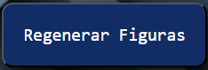
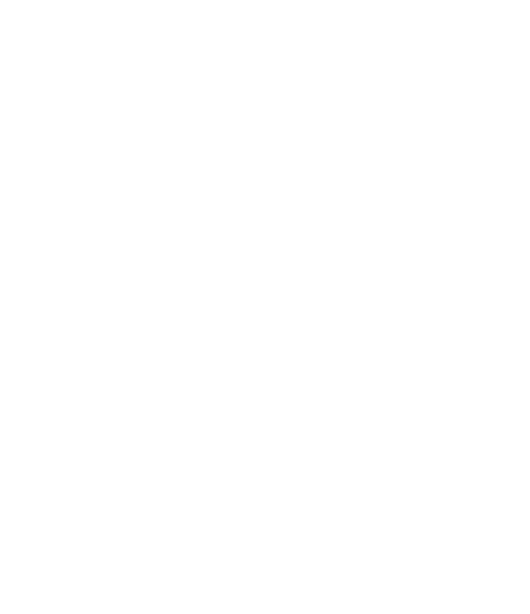
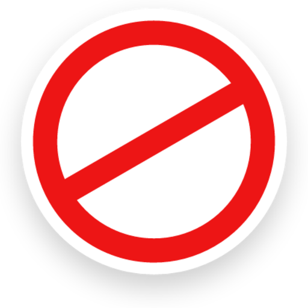
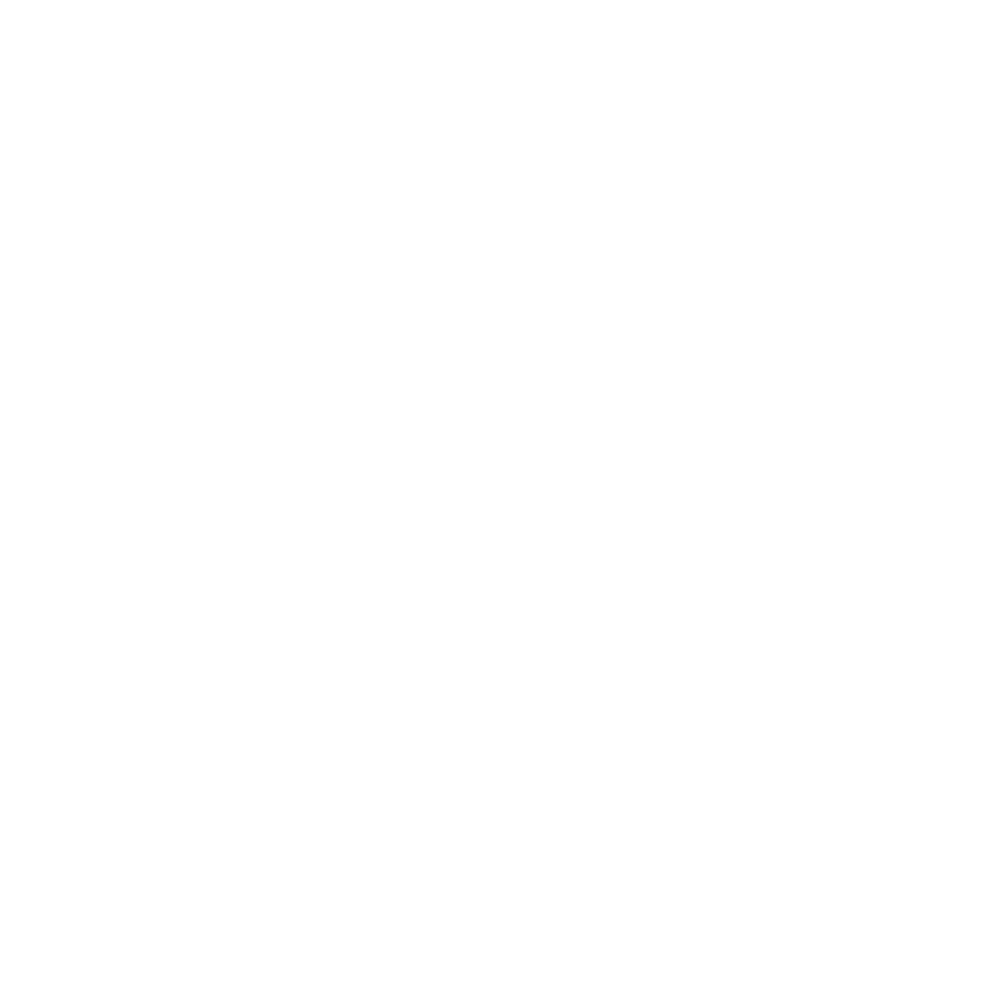

# Aplicación de Figuras en Canvas
Esta aplicación permite crear y gestionar figuras en un lienzo HTML, ofreciendo herramientas para generar, mover, deshacer, rehacer y guardar figuras. 

## Uso de la Aplicación

### Interfaz

La interfaz incluye los siguientes elementos:

- **Lienzo de Dibujo**: Área principal donde se muestran y manipulan las figuras.
- **Botones**:
  
  -   **Deshacer**: Revierte la última acción realizada en el lienzo. Este botón se activa después de realizar cambios y se desactiva si no hay acciones para deshacer.
  -   **Rehacer**: Rehace una acción previamente deshecha. Este botón se activa después de deshacer una acción y se desactiva si no hay acciones para rehacer.
  -   **Reiniciar**: Restaura el estado inicial del lienzo y limpia el historial de deshacer/rehacer. Este botón solo está disponible si se han realizado cambios en el lienzo.
  -   **Descargar Imagen**: Permite descargar una captura del lienzo como una imagen PNG.
  -   **Regenerar Figuras**: Crea nuevas figuras en el lienzo y limpia el historial de deshacer/rehacer.

### Interacciones

1. **Seleccionar y Mover Figuras**:
   - **Click en el Lienzo**: Selecciona una figura. Si haces clic dentro de una figura, se resaltará.
   - **Arrastrar con el Mouse**: Una vez seleccionada una figura, puedes arrastrarla dentro del lienzo. La figura no se moverá fuera del área del lienzo.
   - **Teclado**: Usa las teclas de flecha (`↑`, `↓`, `←`, `→`) para mover la figura seleccionada. Las figuras se moverán fuera del lienzo, pero reaparecerán en el lado opuesto (efecto de envoltura).

2. **Regenerar Figuras**:
   - Haz clic en el botón "Regenerar Figuras" para crear nuevas figuras. Este proceso limpiará las figuras existentes y el historial de deshacer/rehacer.

3. **Deshacer y Rehacer**:
   - Usa los botones "Deshacer" y "Rehacer" para revertir o rehacer acciones en el lienzo. Estos botones se habilitarán o deshabilitarán según el historial de acciones.

4. **Reiniciar Canvas**:
   - Haz clic en el botón "Reiniciar" para restaurar el estado inicial del lienzo, eliminando todas las figuras y restableciendo el historial de acciones. Este botón solo está disponible si se han realizado cambios.

5. **Descargar Imagen**:
   - Haz clic en el botón "Descargar Imagen" para guardar una captura del lienzo en formato PNG.

### Detalles Adicionales

- **Color de los Cuadrados**: El color de cada cuadrado es complementario al color de un circulo.
- **Color de los Circulos**: El color de los circulos se genera aleatoriamente.
- **Color de los Rectángulos**: El color de los rectangulos en un gradiente entre dos colores generados aleatoriamente.
- **Movimiento con el Teclado**: Las figuras se moverán más allá de los límites del lienzo y aparecerán del lado opuesto cuando se utilicen las teclas de flecha.
- **Detalles del Cursor**:
  -  **Pointer**: - Cuando el cursor pasa por encima de un botón, se transforma en una mano para indicar que es clickeable.
  -  **Defaut**: - El cursor se muestra como una flecha estándar cuando está en reposo.
  -  **Not-Allowed**: - Los botones bloqueados muestran un cursor en forma de "prohibido" para indicar que no están disponibles.
  -  **Move**: - Cuando se arrastra una figura, el cursor cambia a una flecha con cuatro direcciones para indicar que se está moviendo.

### Recursos Utilizados

- **HTML5 Canvas**: Para la representación gráfica y las interacciones.
- **JavaScript**: Para la lógica de aplicación, manejo de eventos y manipulación del lienzo.
- **CSS**: Para el diseño y estilo de los elementos de la interfaz.

## Desarrollador

Desarrollado por [**Bascuñan Karen Jazmín**](https://jazbascunan01.github.io/).

## Enlace al Sitio Web

Puedes acceder a la aplicación en el siguiente enlace: [Aplicación de Figuras](https://jazbascunan01.github.io/FIGURAS/)

## Repositorio en GitHub

El código fuente está disponible en: [https://github.com/jazbascunan01/FIGURAS.git](https://github.com/jazbascunan01/FIGURAS.git)
